Valhalla

Table of Contents.
1. [EPU Modules](#epu-modules)

# **Valhalla** 

**Goals:**
1. Common Consumer Experience
1. Common Mechanical Architecture
1. Common Electrical Architecture with UDA
1. Common Electronics Architecture using UEHWA and UESWA

### Roadmap Vision 

 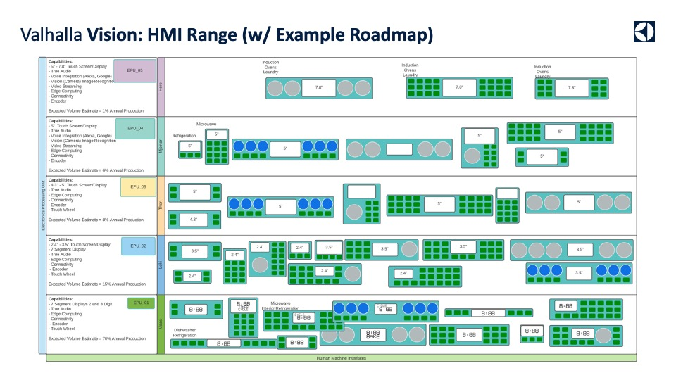

### Consumer Experience 

#### Current Ux Debt Project by Project 

  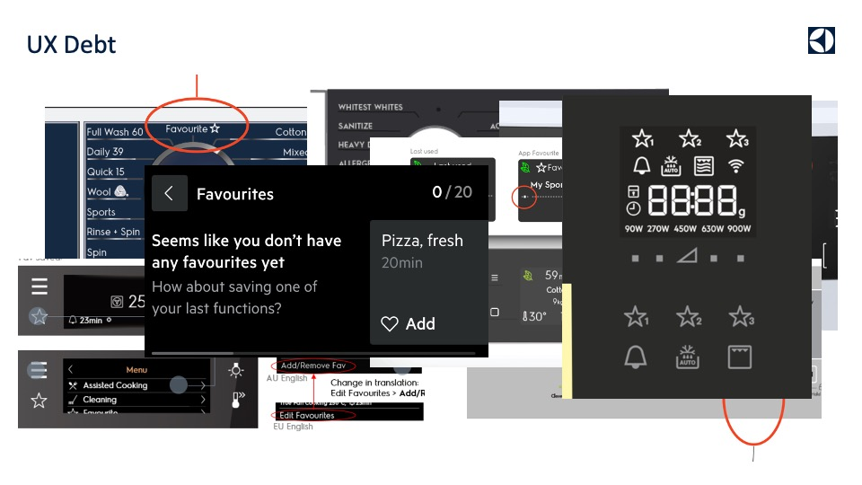
  

#### Interaction Layers 

  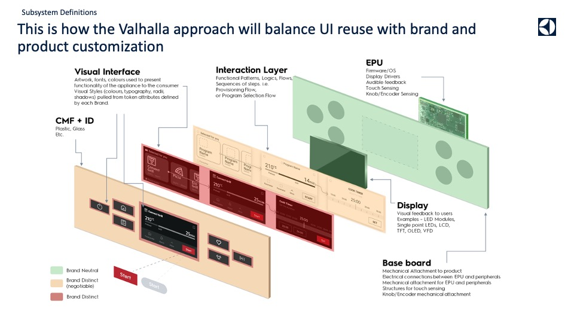
  

#### Reusable Graphics 

  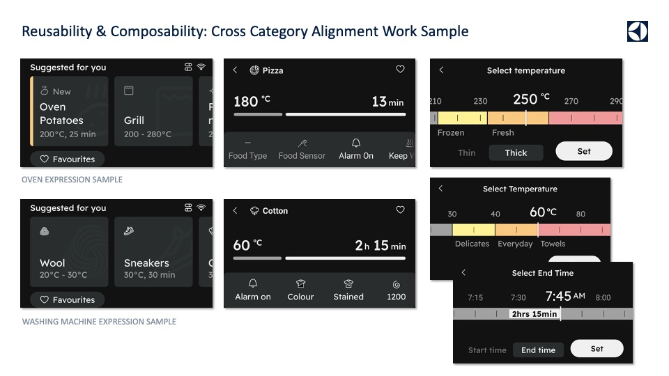
  

#### Modalities and Good/Better/Best 

  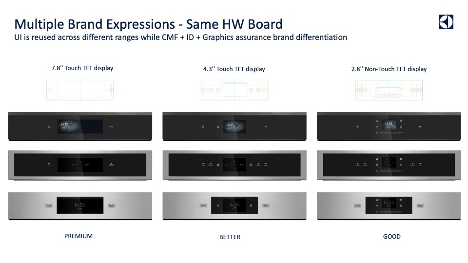
  

#### Cross Product Solutions 

  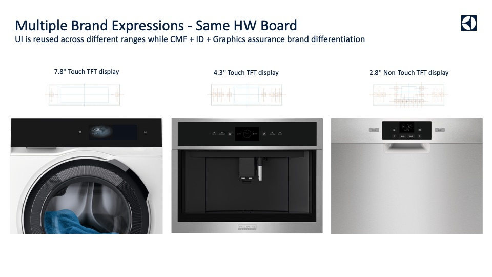
  

### Mechanical Architecture 

#### Process for Mechanical Constraints 

  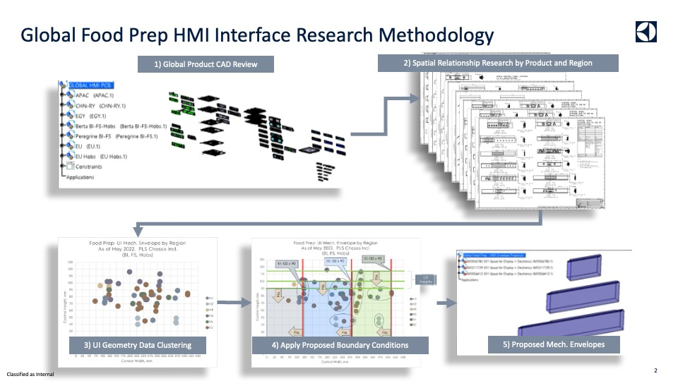
  

#### Cooking 

**Clustering**

  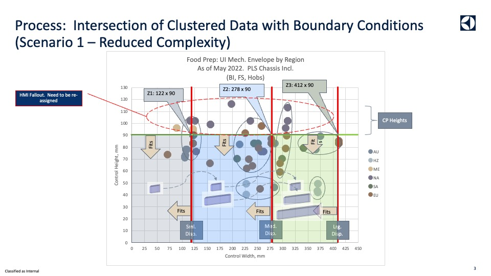
  

**Envelopes**

  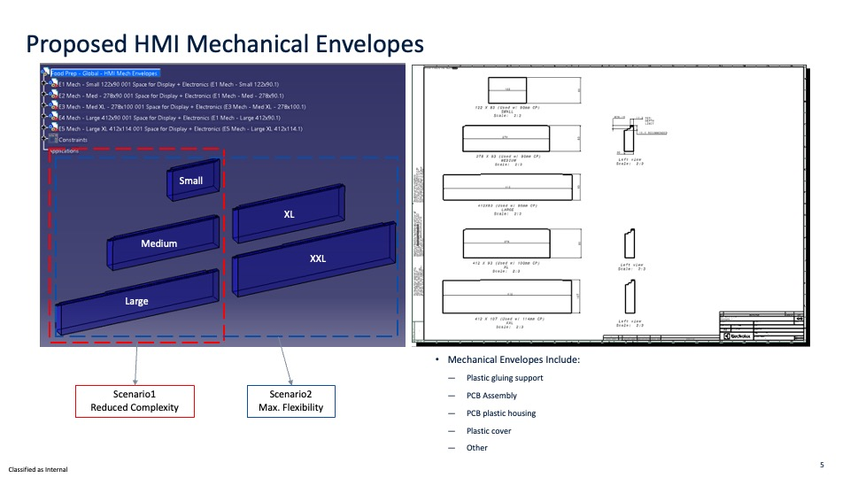
  

**Assemblies**

  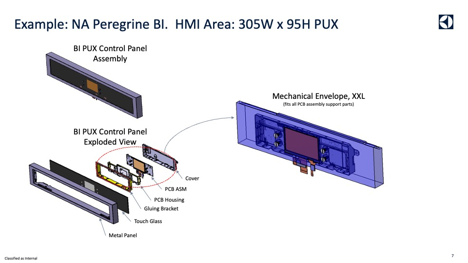
  

#### Laundry Dish 

**Clustering**

  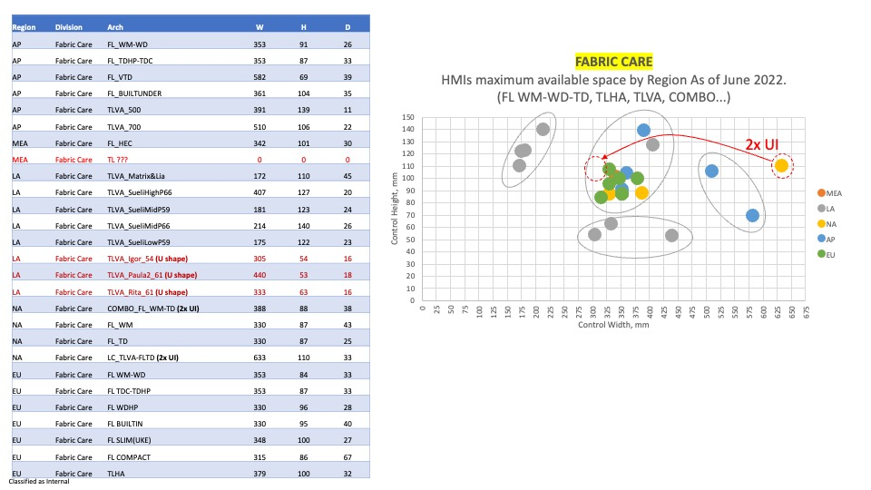
  

**Compound Shapes**

  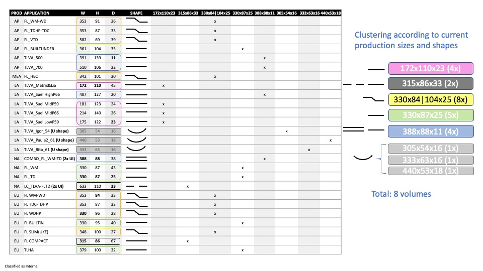
  

**Envelopes**

  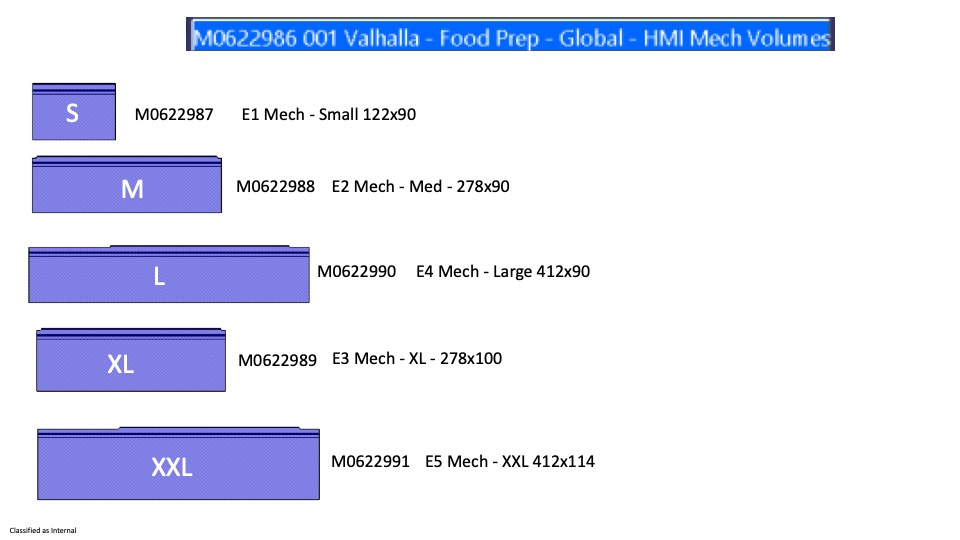
  

#### Refrigeration 

**Current**

  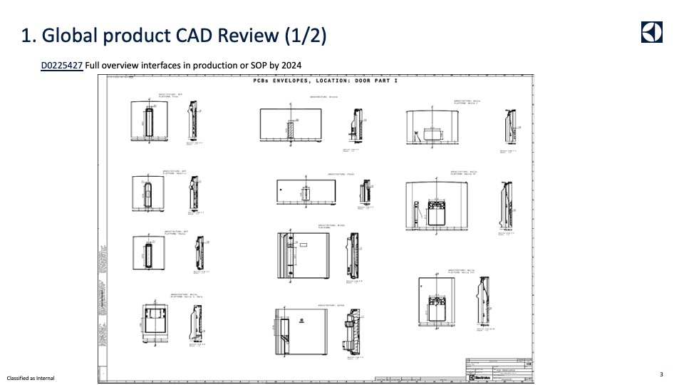
  

**Clustering**

  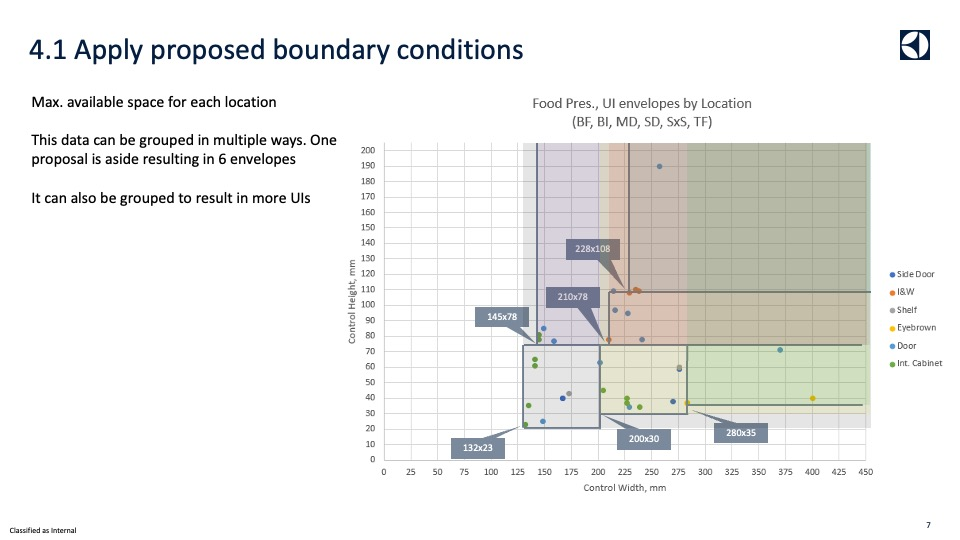
  

**Envelopes**

  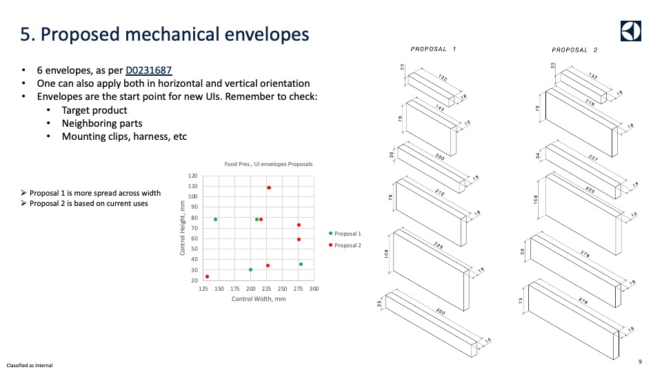
  

#### All Categories 

**Outcomes - All Categories**

  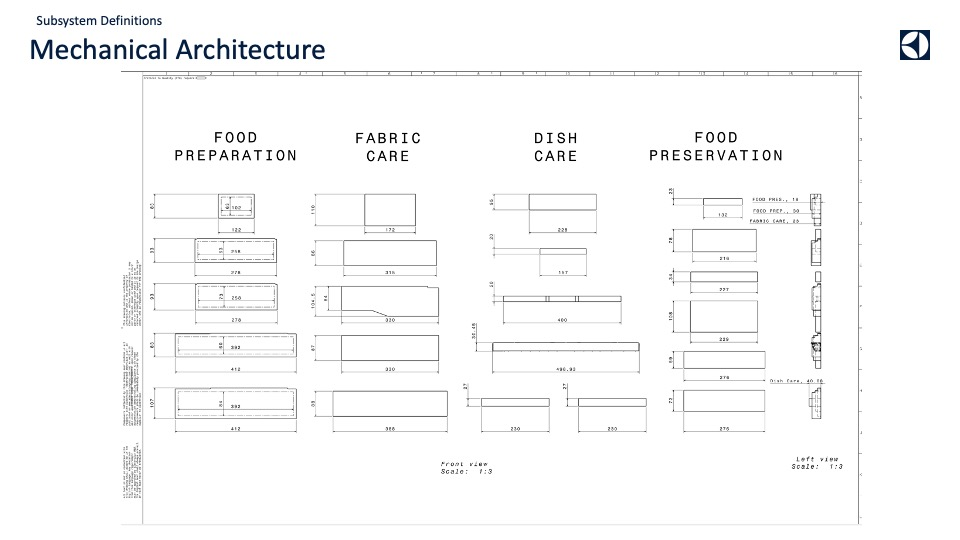
  

### Electrical Systems Architecture 

#### Horizon Systems Architecture 

<!-- 
Notes:  
Image of Horizon Systems architecture all 4!
-->

#### Unified Data Architecture 

  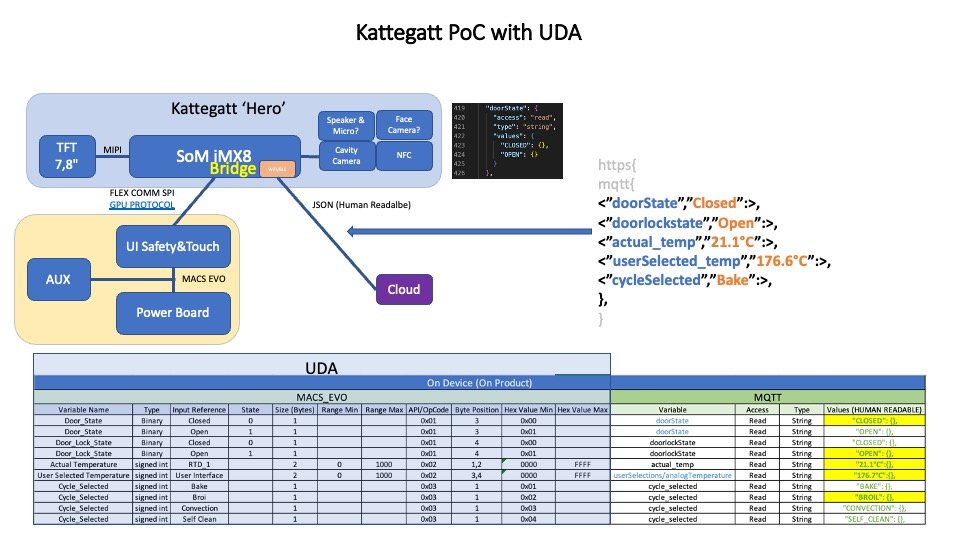
  

#### Appliance States and Modes 

- Appliance modes

  1. Off Mode
  1. User Mode (Default Mode)
  1. Demo Mode
  1. Sabbath Mode
  1. Programming Mode
  1. Diagnostics Mode
 
- Appliance States

  1. Disconnected State
  1. Initialization State
  1. Standby State 
  1. Delay Start State
  1. Active State
  1. Error State
  
- Horizon Subsystems:

  1. UI/HMI 
  1. Main Control Board
  1. Auxiliary Control Boards
  1. Sensors
  1. Loads
  1. Switches
  1. Harnesses/Connections
  1. Connectivity

Features:

1. Temperature
1. Standby
1. Programming and Reprogramming
1. Factory
1. Service
1. ECM
1. Connectivity OTA
1. Connectivity
1. Provisioning
1. Claiming
1. Security and Privacy
1. Over The Air Update
1. Power Loss and Recovery
1. Initialization and Configuration

Operations:
1. Operands (Start and Cancel)

Control Settings
1. General
     1. About
          1. Product Version
               1. Model Number
               1. Serial Number
          1. Control Versions
               1. HMI Software Version
               1. HMI Configuration Version
               1. NIU Software Version
               1. NIU Configuration Version
               1. Control Board Software Version
               1. Control Board Configuration Version
     1. Software Update
          1. Latest Software Version
          1. Update Software Version, if available
              1. Yes
              1. No
1. Connectivity
    1. Wireless Network
    1. Features
    1. Smart Grid
         1. Opt In
         1. Opt Out
    1. Data Analytics
         1. Opt In
         1. Opt Out
    1. WiFi
         1. On/Off
         1. Status:
             1. Provisioning
             1. Deprovisioning
         1. WiFi Network Connected
         1. WiFi Signal Strength
    1. BLE
         1. On/Off
         1. BLE Network
              1. Pair
              1. Unpair
1. Personalization
     1. Time of Day
          1. 12 Hour/24 Hour
          1. Time of Day Manual
          1. Time of Day Automatic (Connected Appliances Only)
     1. Audio
          1. Volume Level
          1. End of Cycle Tone
          1. Key Press Tone
     1. Display & Brightness
          1. Backlight Brightness
          1. Display Theme
     1. Control Lock
          1. Control Locked
          1. Control Unlocked
     1. Calibration:
          1. Cooking
                1. Hobs
                1. Ovens
                     1. Temperature Offset
                1. Hoods
          1. Laundry
          1. Washers
          1. Dryers
          1. Dishwashers
          1. Refrigerators
     1. Modes:
          1. Sabbath Mode
          1. Demo Mode
1. Service Mode
     1. Diagnostics Auto Routine
     1. Results from Auto Routine
     1. Error Failure Codes and Descriptions
     1. System Reboot
     1. Factory Mode/Verification and Validation Mode
     1. Diagnostics Manual
     1. Turn On Loads
     1. Read Sensors/Switches
     1. Restore Factory Reset

### Horizon Subsystems Architecture 
- Subsystem Solutions Architecture HMI/UI
- Subsystem Solutions Architecture Main Controls
- Subsystems Solutions Architecture Loads
- Subsystems Solutions Architecture Sensors
- Subsystems Solutions Architecture Switches
- Subsystems Solutions Architecture Harnesses/Wiring
- Subsystems Solutions Architecture Connectivity

## Horizon Module Architecture 

### Flexible Architecture 

  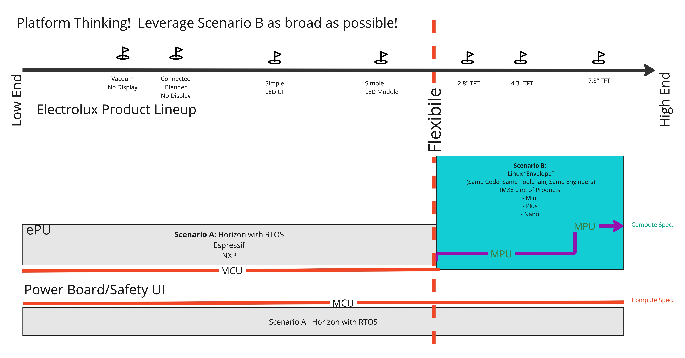
  

<!-- Notes

-->

### EPU Modules: 

|EPU|SOM|Description|Version|Display|RTOS/OS|
|----|----|----|----|----|----|
|EPU_001|IMx8 Mini|Valhalla UI Architecture 001|1.0|7.8" Display|Linux OS/Horizon RTOS|
|EPU_002|IMx8 Mini|Valhalla UI Architecture 002|1.0|4.3" Display|Linux OS/Horizon RTOS|
|EPU_003|IMx8 Mini|Valhalla UI Architecture 003|1.0|2.8" Display|Linux OS/Horizon RTOS|
|EPU_004|M4|Valhalla UI Architecture 004|1.0|LED Module/7 Segment Display|Horizon RTOS|
|EPU_005|M4|Valhalla UI Architecture 005|1.0|LED 7 Segment/Point Display|Horizon RTOS|
