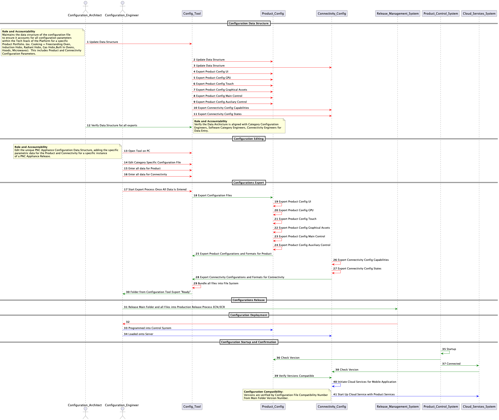
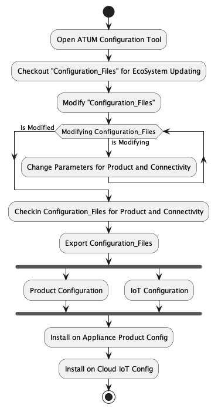

Configurations (IoT and Appliance)

This document describes the Configuation Tool needed to align the Product and Connectivity Configurations, and also show the parametric data to be shared between the Cloud Services System and the Product Control System.

# Sequence Diagram

  
  

<!-- Notes

-->

# Activity Diagram

  
  

<!-- Notes

-->

# Export from Tool

Configuration of Appliance
Configuration of IoT

1. **Main Appliance Configuration** needed for the Appliance including, see linked examples for cooking:
    1. UI
         1. Machine and Appliance Config
              1. .json
              1. .srec
              1. keys.h
         1.	Touch Config
              1. .json
              1. .srec
              1. keys.h
    1. GPU
         1.	Machine and Appliance Config
              1. .json
              1. .srec
              1. keys.h
              1. morph.json
         1.	Textual Assets Config
              1. .json
              1. .srec
              1. keys.h
              1. Translations.json
1. **Main Connectivity Configuration** ONLY built what is needed for the Cloud Ecosystem including:
     1. Capability.json (see example in Configurations for Appliance and IoT)
     1. State.json (see example in Configurations for Appliance and IoT)

## Examples of Appliance Configuration
Example from Supex 4/8 S00007697_A.json Machine_And_Performance_Config for the User Interface ONLY.
Format should be in following formats:

1. UI
     1. Machine and Appliance Config
          1. [.json](./document_formats/S00007697_A_C012/UI/MachineAndPerformanceConfig/S00007697_A.json)
          1. [.srec](./document_formats/S00007697_A_C012/UI/MachineAndPerformanceConfig/S00007697_A.srec)
          1. [keys.h](./document_formats/S00007697_A_C012/UI/MachineAndPerformanceConfig/S00007697_A_keys.h)
     1.	Touch Config
          1. [.json](./document_formats/S00007697_A_C012/UI/TouchConfig/S00007950_A.json)
          1. [.srec](./document_formats/S00007697_A_C012/UI/TouchConfig/S00007950_A.srec)
          1. [keys.h](./document_formats/S00007697_A_C012/UI/TouchConfig/S00007950_A_keys.h)
1. GPU
     1.	Machine and Appliance Config
          1. [.json](./document_formats/S00007697_A_C012/GPU/MachineAndPerformanceConfig/S00007697_A.json)
          1. [.srec](./document_formats/S00007697_A_C012/GPU/MachineAndPerformanceConfig/S00007697_A.srec)
          1. [keys.h](./document_formats/S00007697_A_C012/GPU/MachineAndPerformanceConfig/S00007697_A_keys.h)
          1. [morph.json](./document_formats/S00007697_A_C012/GPU/MachineAndPerformanceConfig/S00007697_A_morph.json)
     1.	Textual Assets Config
          1. [.json](./document_formats/S00007697_A_C012/GPU/TextualAsset/S00008173_A.json)
          1. [.srec](./document_formats/S00007697_A_C012/GPU/TextualAsset/S00008173_A.srec)
          1. [keys.h](./document_formats/S00007697_A_C012/GPU/TextualAsset/S00008173_A_keys.h)
          1. [Translations.json](./document_formats/S00007697_A_C012/GPU/TextualAsset/translations.json)

# Examples of IoT Configuration Files

## Capabilities.json

[Link to Example for Cooking Built In Oven IoT Capabilities](./document_formats/ov_capabilities_example.json)

## States.json

[Link to Example for Cooking Built In Oven IoT States](./document_formats/ov_state_example.json)

