# Kattegatt

## Table of Contents

1. [Product Categories and Product Platform](#product-categories-and-product-platform)
     1. [Cooking](#cooking)
     1. [Laundry](#laundry)
     1. [Refrigeration](#refrigeration)
1. [Global Strategy](#global-strategy)
1. [One Pager of Initiatives](#one-pager-initiatives)
1. [Kattegatt Slice/PoC](#kattegatt-slicepoc)
     1. [Product Description Kattegatt](#product-description)
     1. [Systems Design Kattegatt](#system-design)
     1. [Flexible Architecture](#flexible-architecture)
     1. [Use Case Cluster Electrical and Electronics System Design for PoC](#use-case-cluster-electrical-and-electronics-system-design-for-poc)
     1. [Tech Stack Delivery Product Teams](#tech-stack-delivery-product-teams)
     1. [Tech Stack Delivery Software Teams](#tech-stack-delivery-software-teams)
     1. [Continuous Integration and Development](#continuous-integrationcontinuous-development-video)
     1. [Outcomes Of Kattegatt](#outcomes-of-kattegatt)
1. [Valhalla](#valhalla)
     1. [Consumer Experience](#consumer-experience)
     1. [Mechanical Architecture](#mechanical-architecture)
     1. [Electrical Architecture](#electrical-architecture)
     1. [Electronics Architecture](#electronics-architecture)

## Design Principles

  
  

## Product Categories and Product Platform
Product Categories:

  
  

  
  

<!-- Notes

-->

### Cooking
|Category|Platform|Sub-Category|
|---|---|---|
|Cooking|Built In Ovens|Single|
|Cooking|Built In Ovens|Double|
|Cooking|Built In Ovens|Combo|
|Cooking|Built In Ovens|Dedicated Microwave|
|Cooking|Free Standing Oven|Single with Induction|
|Cooking|Free Standing Oven|Single with Radiant|
|Cooking|Free Standing Oven|Single with Gas|
|Cooking|Hobs/Cooktop|Induction|
|Cooking|Hobs/Cooktop|Radiant|
|Cooking|Hobs/Cooktop|Gas|
|Cooking|Hoods|Single|

### Laundry
|Category|Platform|Sub-Category|
|---|---|---|
|Laundry|Washer|Front Load|
|Laundry|Washer|Top Load|
|Laundry|Dryer|Single|
|Laundry|Combo|Single|

### Refrigeration
|Category|Platform|Sub-Category|
|---|---|---|
|Refrigeration|Side By Side|Side By Side|
|Refrigeration|Side By Side|FDBM|
|Refrigeration|Side By Side|Multi Door|
|Refrigeration|Top Mount|Bottom Mount|
|Refrigeration|Freezers|Ice Chest|

## Global Strategy
Strategy to support all regions across all product categories.

  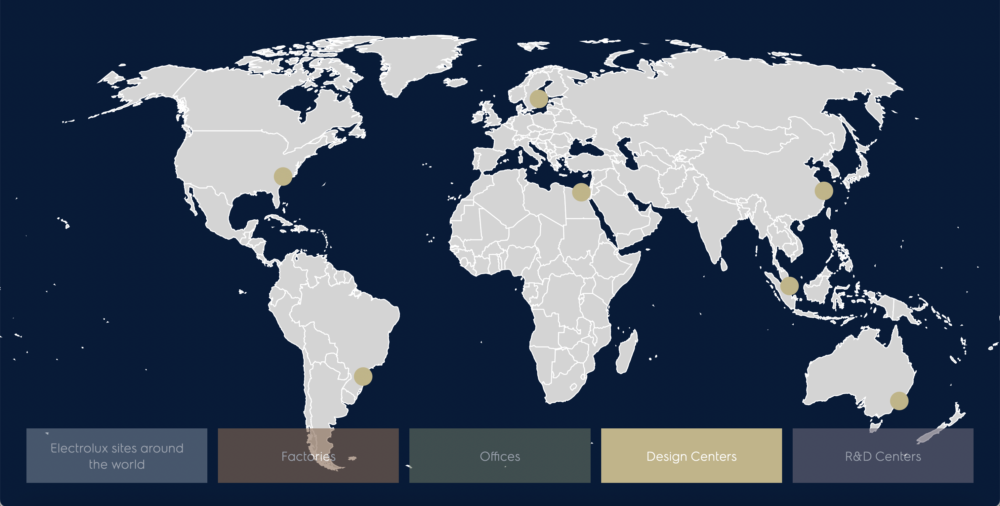
  

<!-- Notes

-->

1. Europe
1. North America/Canada
1. South America
1. Asia

## One Pager Initiatives

  
  

<!-- Notes

-->

## Kattegatt Slice/PoC
### Product Description
[**BIO_ECWS3012AS-OL**](https://www.electrolux.com/en/p/kitchen/wall-ovens/single-wall-ovens/ECWS3012AS)
Single Built In Oven Product Platform

  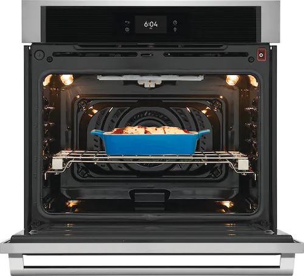
  

Control Panel for Built In Oven

  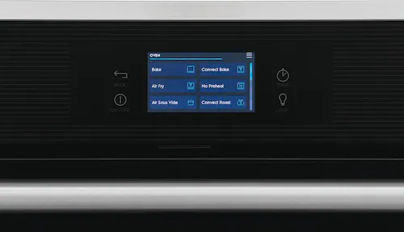
  

### System Design

  
  

<!-- Notes

-->

### Flexible Architecture

  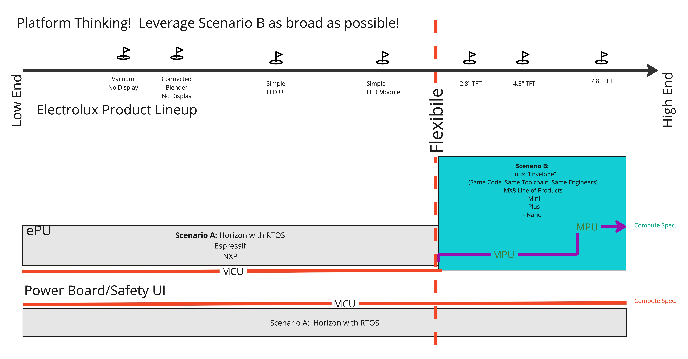
  

<!-- Notes

-->
|EPU|SOM|Description|Version|Display|RTOS/OS|
|----|----|----|----|----|----|
|EPU_001|IMx8 Mini|Valhalla UI Architecture 001|1.0|7.8" Display|Linux OS/Horizon RTOS|
|EPU_002|IMx8 Mini|Valhalla UI Architecture 002|1.0|4.3" Display|Linux OS/Horizon RTOS|
|EPU_003|IMx8 Mini|Valhalla UI Architecture 003|1.0|2.8" Display|Linux OS/Horizon RTOS|
|EPU_004|M4|Valhalla UI Architecture 004|1.0|LED Module/7 Segment Display|Horizon RTOS|
|EPU_005|M4|Valhalla UI Architecture 005|1.0|LED 7 Segment/Point Display|Horizon RTOS|

### Use Case Cluster Electrical and Electronics System Design for PoC

  
  

  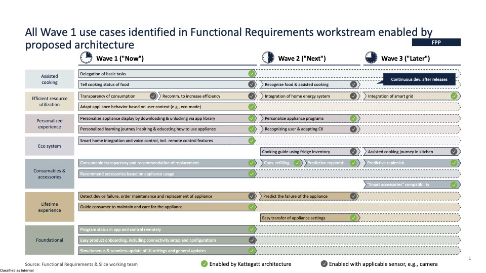
  

  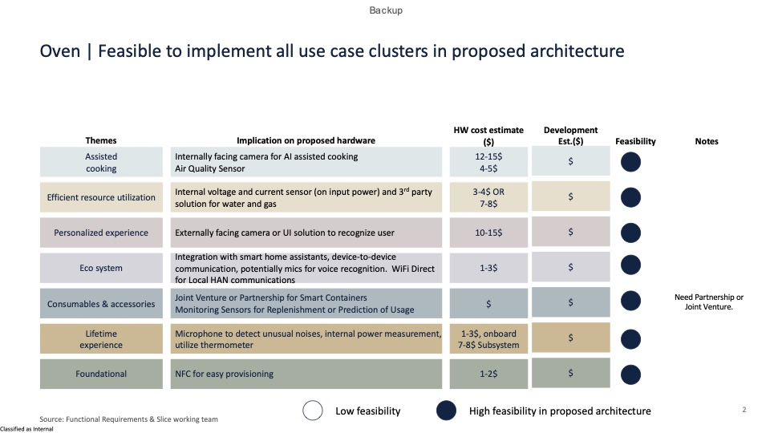
  

  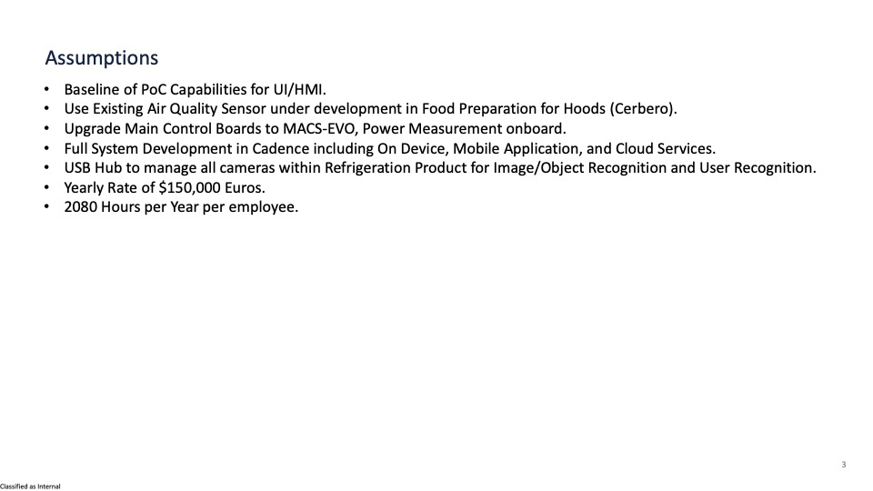
  

  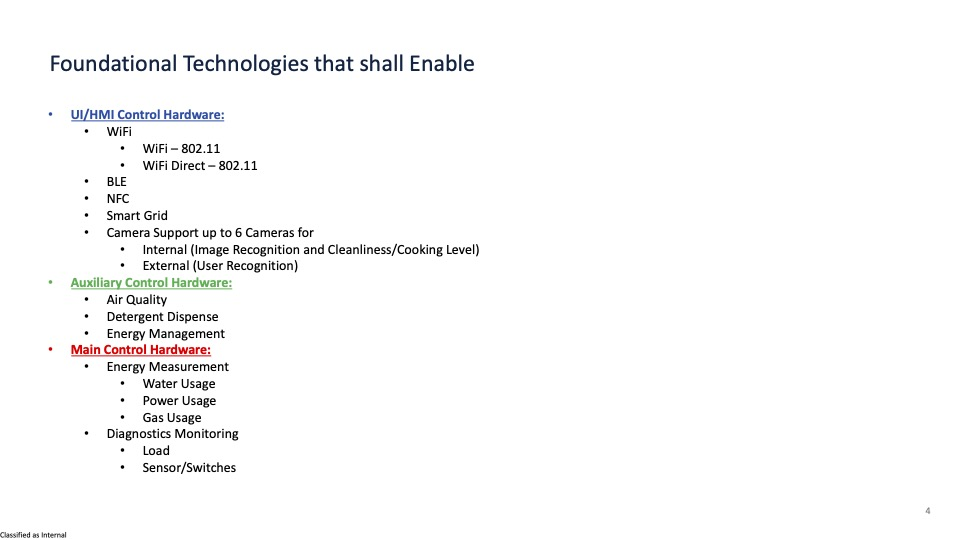
  

  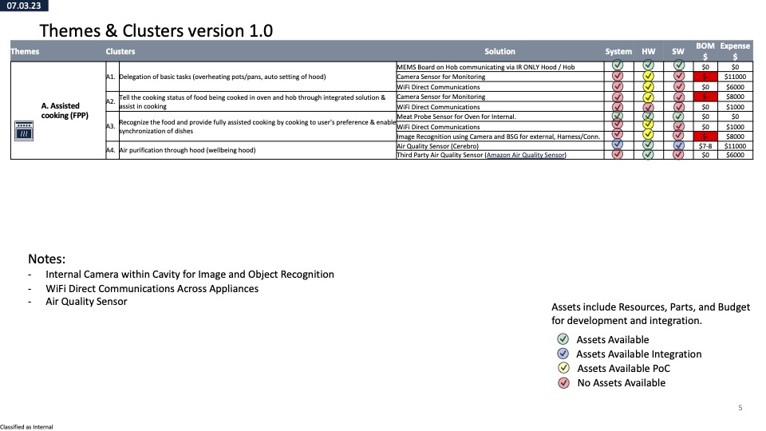
  

  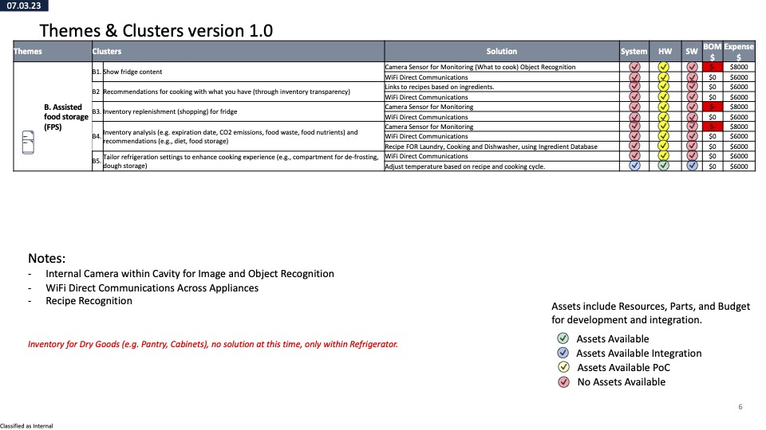
  

  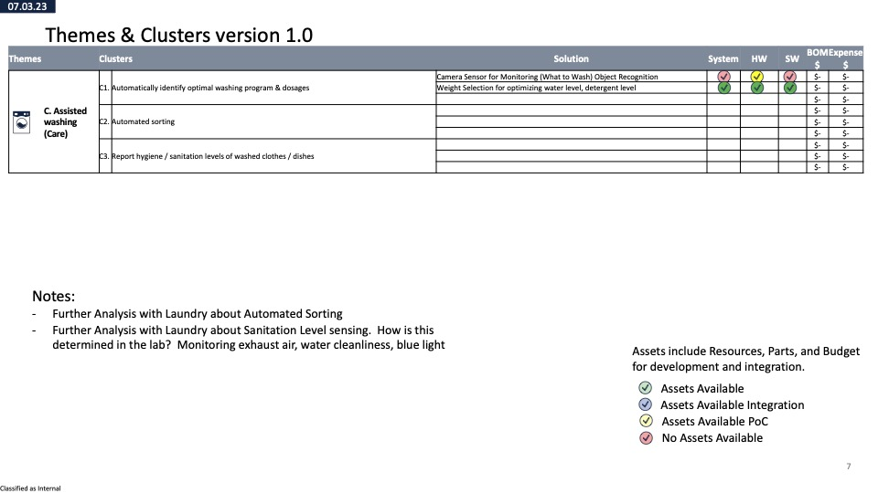
  

  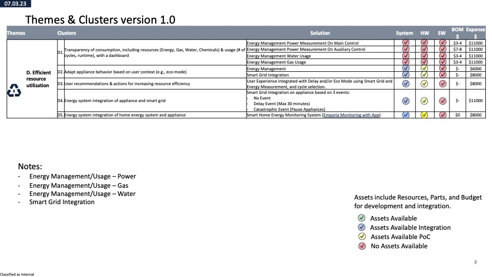
  

  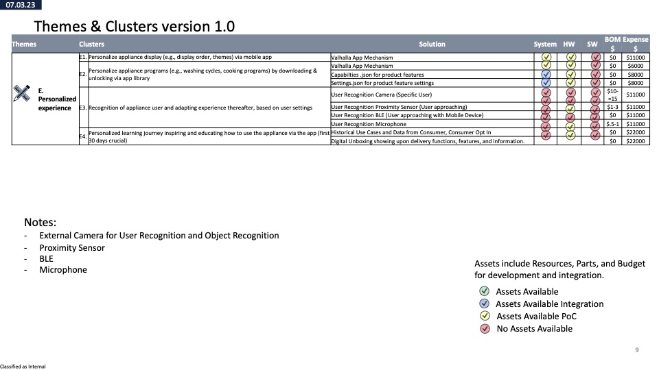
  

  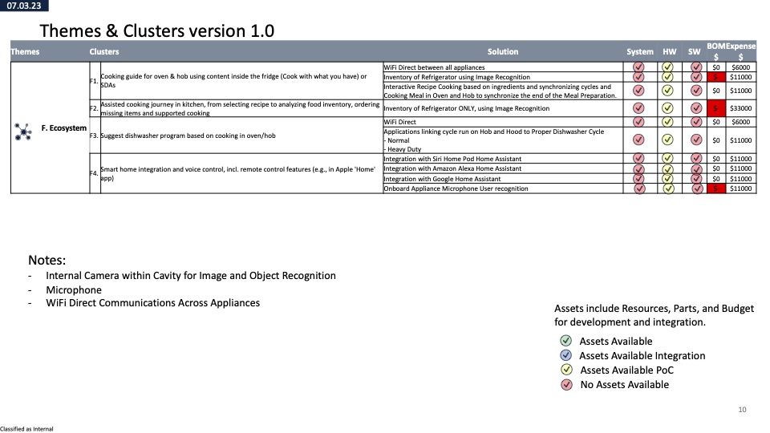
  

  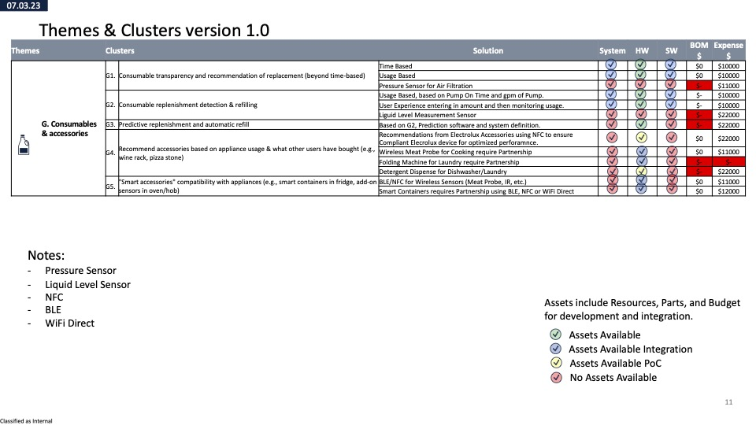
  

  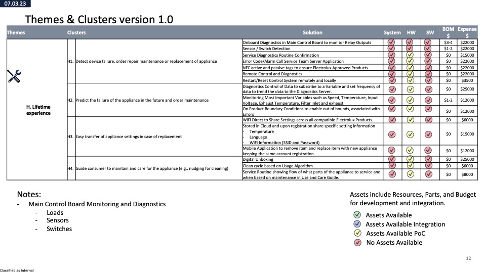
  

  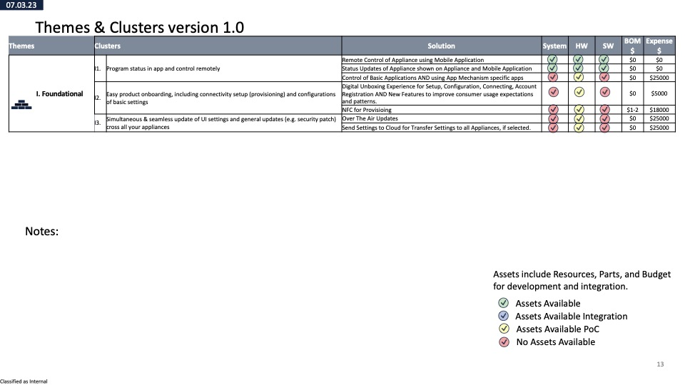
  

  
  

<!-- Notes

-->

### Tech Stack Delivery Product Teams

  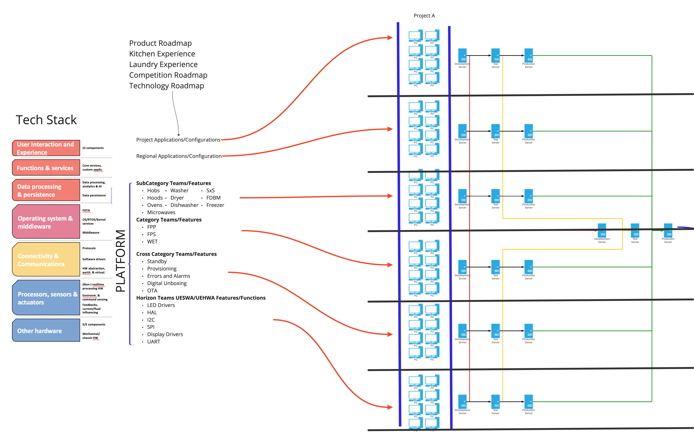
  

<!-- Notes

-->

### Tech Stack Delivery Software Teams

  
  

<!-- Notes

-->

### Continuous Integration/Continuous Development Video
[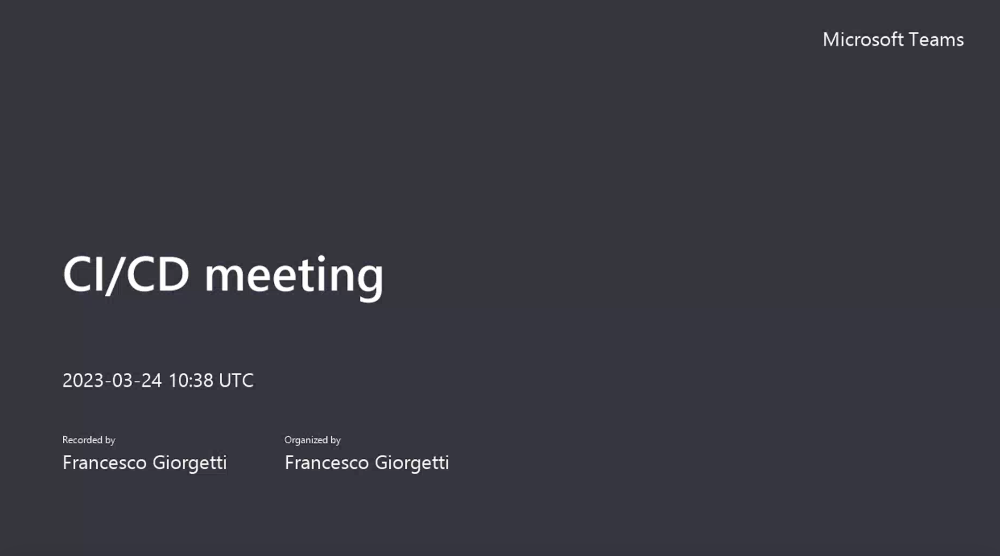](https://electrolux-my.sharepoint.com/personal/francesco_giorgetti_electrolux_com/_layouts/15/stream.aspx?id=%2Fpersonal%2Ffrancesco%5Fgiorgetti%5Felectrolux%5Fcom%2FDocuments%2FFile%20di%20chat%20di%20Microsoft%20Teams%2FCI%5FCD%20meeting%2D20230324%5F113819%2DRegistrazione%20della%20riunione%20%281%29%2Emp4&referrer=Teams%2ETEAMS%2DELECTRON&referrerScenario=p2p%5Fns%2Dbim&ga=1)

## Outcomes of Kattegatt

Initiatives:
1.	Valhalla UI Initiative to continue using the PoC (i.e. EPU = MPU/MCU)
1.	UDA Initiative to Continue
1.	UEA/UESWA Initiatives are part of the tech stack and should continue.
1.	Start a initiative with the Main Control Boards to integrate the inverter/motor control.

What we need from BCG is a plan for the following:   
1.	Way of Working – Agile across the teams.
1.	Budget to fund initiatives
1.	UCC aligned to these Initiatives
1.	Teams with Product Owners, Scrum Masters, contributing to the initiatives.
1.	Product Suites aligned with the business proposal for profitability OR Strategic Market Objectives
Right Now I see they are validating strategies and initiatives we already have in place, and I want to ensure the outcomes of the work BCG is sustainable for the inititiaves…

## **Valhalla**

**Goals:**
1. Common Consumer Experience
1. Common Mechanical Architecture
1. Common Electrical Architecture with UDA
1. Common Electronics Architecture using UEHWA and UESWA

#### Roadmap Vision

  
  

### Consumer Experience
#### Current Ux Debt Project by Project

  
  

#### Interaction Layers

  
  

#### Reusable Widgets

  
  

#### Modalities and Good/Better/Best

  
  

#### Cross Product Solutions

  
  

### Mechanical Architecture
#### Process for Mechanical Constraints

  
  

#### Cooking

**Clustering**

  
  

**Envelopes**

  
  

**Assemblies**

  
  

#### Laundry Dish
**Clustering**

  
  

**Compound Shapes**

  
  

**Envelopes**

  
  

#### Refrigeration

**Current**

  
  

**Clustering**

  
  

**Envelopes**

  
  

#### All Categories

**Outcomes - All Categories**

  
  

### Electrical Architecture

Horizon Systems Architecture:

#### Appliance States and Modes

Appliance modes

1. Off Mode
1. User Mode (Default Mode)
1. Demo Mode
1. Sabbath Mode
1. Programming Mode
1. Diagnostics Mode
 
Appliance States

1. Disconnected State
1. Initialization State
1. Standby State 
1. Delay Start State
1. Active State
1. Error State

Subsystems:

1. UI/HMI 
1. Main Control Board
1. Auxiliary Control Boards
1. Sensors
1. Loads
1. Switches
1. Harnesses/Connections

Features:

1. Temperature
1. Standby
1. Programming and Reprogramming
1. Factory
1. Service
1. ECM
1. Connectivity OTA
1. Connectivity
1. Provisioning
1. Claiming
1. Security and Privacy
1. Over The Air Update
1. Power Loss and Recovery
1. Initialization and Configuration

Operations:
1. Operands (Start and Cancel)

Control Settings
1. General
     1. About
          1. Product Version
               1. Model Number
               1. Serial Number
          1. Control Versions
               1. HMI Software Version
               1. HMI Configuration Version
               1. NIU Software Version
               1. NIU Configuration Version
               1. Control Board Software Version
               1. Control Board Configuration Version
     1. Software Update
          1. Latest Software Version
          1. Update Software Version, if available
              1. Yes
              1. No
1. Connectivity
    1. Wireless Network
    1. Features
    1. Smart Grid
         1. Opt In
         1. Opt Out
    1. Data Analytics
         1. Opt In
         1. Opt Out
    1. WiFi
         1. On/Off
         1. Status:
             1. Provisioning
             1. Deprovisioning
         1. WiFi Network Connected
         1. WiFi Signal Strength
    1. BLE
         1. On/Off
         1. BLE Network
              1. Pair
              1. Unpair
1. Personalization
     1. Time of Day
          1. 12 Hour/24 Hour
          1. Time of Day Manual
          1. Time of Day Automatic (Connected Appliances Only)
     1. Audio
          1. Volume Level
          1. End of Cycle Tone
          1. Key Press Tone
     1. Display & Brightness
          1. Backlight Brightness
          1. Display Theme
     1. Control Lock
          1. Control Locked
          1. Control Unlocked
     1. Calibration:
          1. Cooking
                1. Hobs
                1. Ovens
                     1. Temperature Offset
                1. Hoods
          1. Laundry
          1. Washers
          1. Dryers
          1. Dishwashers
          1. Refrigerators
     1. Modes:
          1. Sabbath Mode
          1. Demo Mode
1. Service Mode
     1. Diagnostics Auto Routine
     1. Results from Auto Routine
     1. Error Failure Codes and Descriptions
     1. System Reboot
     1. Factory Mode/Verification and Validation Mode
     1. Diagnostics Manual
     1. Turn On Loads
     1. Read Sensors/Switches
     1. Restore Factory Reset

Unified Data Architecture

  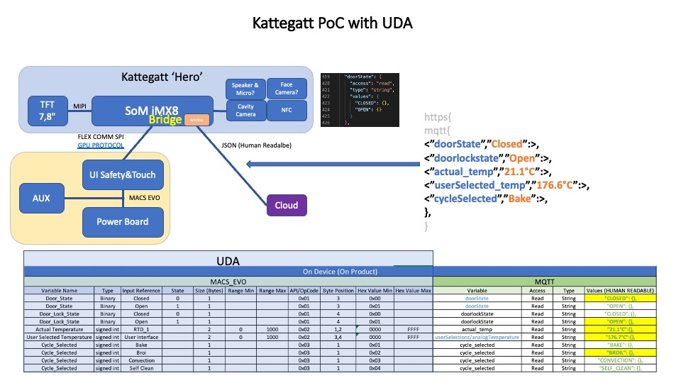
  

### Electronics Architecture

#### UEA - Unified Electronics Hardware Architecture

  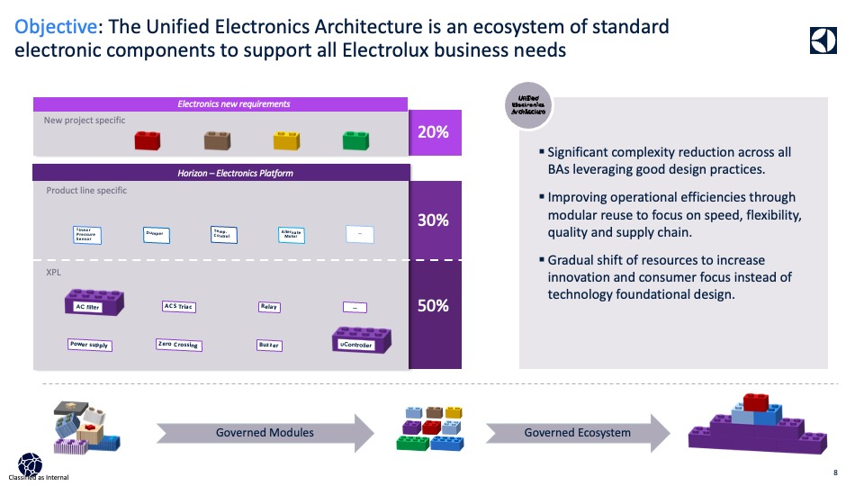
  

#### UESWA - Unified Electronics Software Architecture

  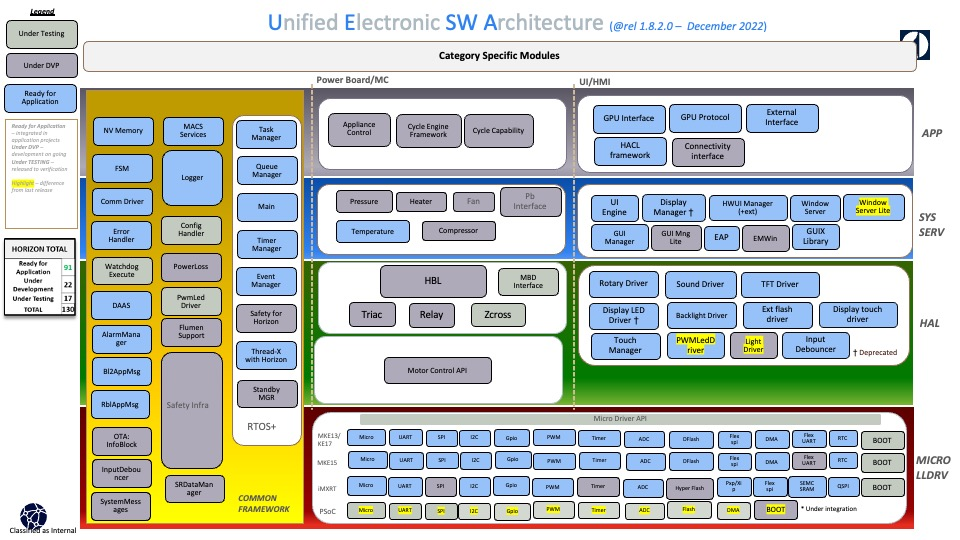
  

