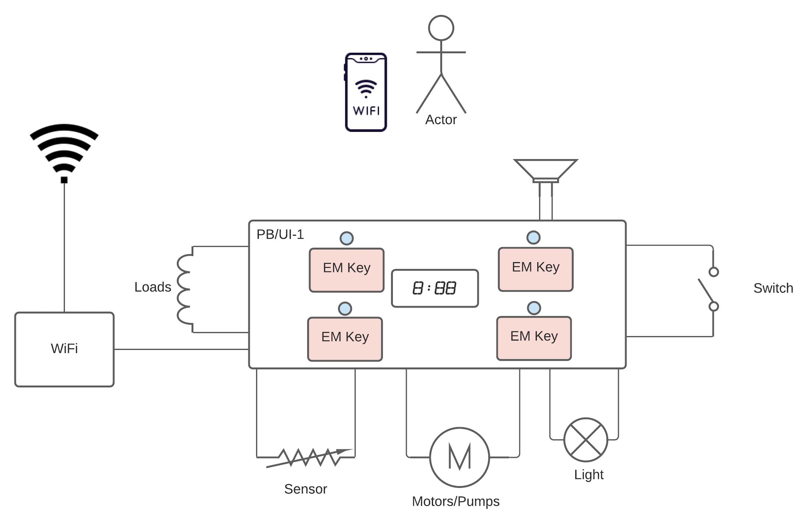
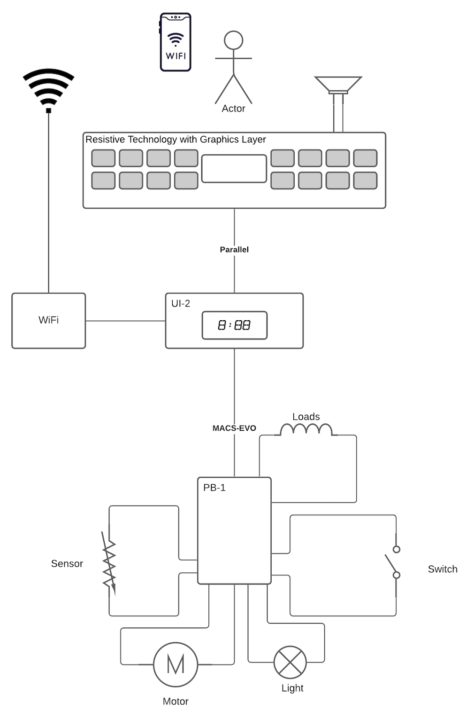
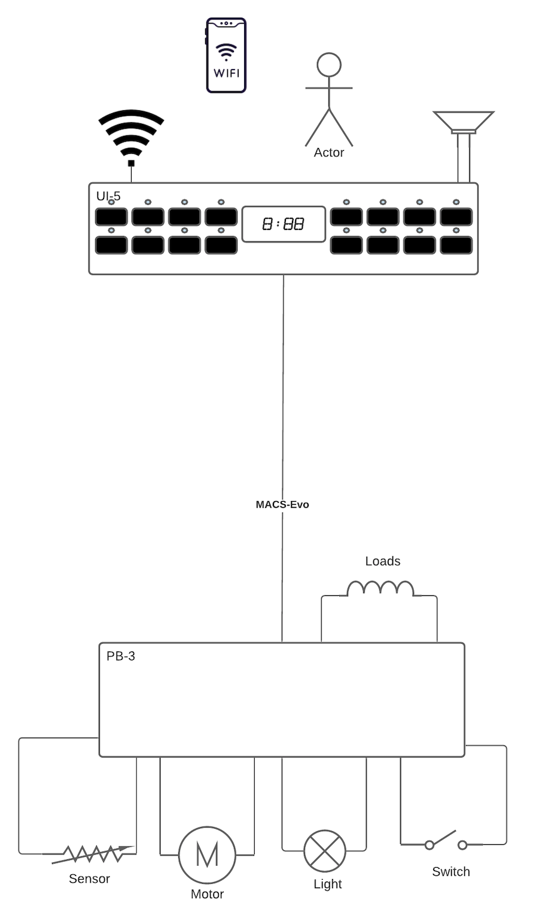

Horizon Systems Architecture

## System of Systems
Complexity of Systems of Systems with Product 
	• Wired Interface
	• Wireless Interface 

 
 
Agile Delivery of Features/Functions/Enablers:

 
 

 
 
## Product Systems Architecture
Product System Architecture
 
Product Electronics Communications Architecture
 
 
 
 

All Products SHALL comply to the following:
	1. HMI/UI SHALL Power Boards and Motor Controls SHALL control all Loads, Sensors, Switches.
	2. Software:  Standard Horizon OS for HMI, Power Boards and Motor Controls
	3. Hardware:  Standard Horizon Hardware EDM's.
	4. Configuration:  Systems SHALL be able to be configured from System, Subsystem and Module Level.
 
Product Architecture - Electrical 

 
 
 
 
 
 
Control Systems Architectures
CSPA1
- Single Control for Main Control and User Interface Functions.
- Connectivity Supported.

  
  

CSPA2
- Separate User Interface Board with Parallel Interface to Simple Base Board with no microcontroller nor microprocessor.
- Separate Main Control Board to manage loads, sensors and switches.
- Connectivity Supported.

  
  

CSPA3
- Separate User Interface Board with Serial Interface to Base Board with microcontroller or a microprocessor.
- Separate Main Control Board to manage loads, sensors and switches.
- Connectivity Supported.

  
  

CSPA4
- Separate User Interface Board with Serial Interface to Base Board with microcontroller or a microprocessor and a separate Electronics Processing Unit MicroProcessor for managing high level graphical functions, interactions, experience, strings and languages.
- Separate Main Control Board to manage loads, sensors and switches.
- Connectivity Supported.

  
  

 
## Cross Category
 
 
## Oven
Product Roadmap and Generation Plan for Ovens
- [FPP Roadmap Ovens Architecture](https://electrolux.sharepoint.com/:p:/r/sites/ETONA/_layouts/15/guestaccess.aspx?email=wallace.elston%40electrolux.com&e=4%3AFPdEpo&at=9&wdLOR=cC46D6461-FB2D-6049-9565-F7C5B4E98C64&share=Eb_aDQu_95xNmFa5ufvHqiUBfK63ZHU-he5lP_Rpbh-yoA)

- [Control Roadmaps](https://electrolux.sharepoint.com/:p:/r/sites/GlobalFoodPrepETOSystemsTeam/_layouts/15/Doc.aspx?sourcedoc=%7B598E3DB8-6A0B-4355-8A4A-E2C9DA293DFC%7D&file=20220111_Global%20Ovens%20Catalog.pptx&action=edit&mobileredirect=true&cid=2d755ba6-c7e1-437d-84d5-b42ba6d7d60c)

## Hoods
Product Roadmap and Generation Plan for Hoods
- [FPP Roadmap Hobs and Hoods](https://teams.microsoft.com/l/file/bb65eb34-12e6-4b0f-b110-22a484eabfc1?tenantId=d2007bef-127d-4591-97ac-10d72fe28031&fileType=pdf&objectUrl=https%3A%2F%2Felectrolux-my.sharepoint.com%2Fpersonal%2Fpravin_kumar_electrolux_com%2FDocuments%2FMicrosoft%20Teams%20Chat%20Files%2FElectronics%20Catalog%20Hobs%20-%20DRAFT%202021-03-12.pdf&baseUrl=https%3A%2F%2Felectrolux-my.sharepoint.com%2Fpersonal%2Fpravin_kumar_electrolux_com%2F&serviceName=p2p&threadId=19:meeting_YzgzYmVlMGMtOTgzNy00MGY0LTg3NmMtMGE1MWU1ZWUxZTgw@thread.v2&messageId=1617033531242)

- [Control Roadmaps](https://electrolux.sharepoint.com/:p:/r/sites/GlobalFoodPrepETOSystemsTeam/_layouts/15/Doc.aspx?sourcedoc=%7B88CC2CC7-9FFF-41CA-8CC6-A4042055B35B%7D&file=Hoods%20Catalog%2020211025.pptx&action=edit&mobileredirect=true&cid=0b961095-df92-4154-a7e4-ec4b1110cdca)

## Hobs
Product Roadmap and Generation Plan for Hobs
- [FPP Roadmap Hobs and Hoods](https://teams.microsoft.com/l/file/bb65eb34-12e6-4b0f-b110-22a484eabfc1?tenantId=d2007bef-127d-4591-97ac-10d72fe28031&fileType=pdf&objectUrl=https%3A%2F%2Felectrolux-my.sharepoint.com%2Fpersonal%2Fpravin_kumar_electrolux_com%2FDocuments%2FMicrosoft%20Teams%20Chat%20Files%2FElectronics%20Catalog%20Hobs%20-%20DRAFT%202021-03-12.pdf&baseUrl=https%3A%2F%2Felectrolux-my.sharepoint.com%2Fpersonal%2Fpravin_kumar_electrolux_com%2F&serviceName=p2p&threadId=19:meeting_YzgzYmVlMGMtOTgzNy00MGY0LTg3NmMtMGE1MWU1ZWUxZTgw@thread.v2&messageId=1617033531242)

- [Control Roadmaps](https://electrolux.sharepoint.com/:p:/r/sites/GlobalFoodPrepETOSystemsTeam/_layouts/15/Doc.aspx?sourcedoc=%7BEEFEFC29-7FC6-4EC8-83E6-F6E2793FF1B6%7D&file=Electronics%20Catalog%20Hobs%20-%20DRAFT.pptx&action=edit&mobileredirect=true&cid=f52b9441-cda8-4302-8a3b-e792c470a9d1)
 
## Refrigeration
Product Roadmap and Generation Plan for Refrigeration
@Richard Martin to link to Documentation for Refrigeration

- [Control Roadmaps](https://electrolux.sharepoint.com/sites/GlobalHMIUIStrategy/Shared%20Documents/Forms/AllItems.aspx?id=%2Fsites%2FGlobalHMIUIStrategy%2FShared%20Documents%2FGeneral%2FProduct%20Category%2FValhalla%20Clustering%2FFPS%2FFPS%20Electronic%20catalogue%202020%20v06%2Epdf&parent=%2Fsites%2FGlobalHMIUIStrategy%2FShared%20Documents%2FGeneral%2FProduct%20Category%2FValhalla%20Clustering%2FFPS)

 
## Dishwasher
Product Roadmap and Generation Plan for Dishwasher
@Sandro Tarquini to link Documentation for WET Roadmap:

- [Control Roadmaps](https://electrolux.sharepoint.com/:p:/r/sites/ValhallaWet/_layouts/15/Doc.aspx?sourcedoc=%7B57B930FB-170D-4102-B47F-F3A04982E3C9%7D&file=20220225_Global%20FC%20Catalog.pptx&action=edit&mobileredirect=true&cid=25863501-ead0-4727-9f43-479d2478d8c9)

## Washer
Product Roadmap and Generation Plan for Washer

- [Fabric Care Generation Plan](https://teams.microsoft.com/l/file/8BACB85D-2E09-41D7-9CAF-22F704A544BF?tenantId=d2007bef-127d-4591-97ac-10d72fe28031&fileType=pptx&objectUrl=https%3A%2F%2Felectrolux.sharepoint.com%2Fsites%2FWETSystemEngineering%2FShared%20Documents%2FGeneral%2FGeneration%20Plan%20Fabric%2F2021_01_20%20EU%20Laundry%20GenPlan%20for%20EA1%20calculation_Draft1.pptx&baseUrl=https%3A%2F%2Felectrolux.sharepoint.com%2Fsites%2FWETSystemEngineering&serviceName=teams&threadId=19:68bbc45ccd1f4a76b1f333b5c278883c@thread.tacv2&groupId=545c574e-3750-4b04-a1f6-1b2b0883a8a1)

- [Control Roadmaps]()

## Dryer
Product Roadmap and Generation Plan for Dryer

- [Fabric Care Generation Plan](https://teams.microsoft.com/l/file/8BACB85D-2E09-41D7-9CAF-22F704A544BF?tenantId=d2007bef-127d-4591-97ac-10d72fe28031&fileType=pptx&objectUrl=https%3A%2F%2Felectrolux.sharepoint.com%2Fsites%2FWETSystemEngineering%2FShared%20Documents%2FGeneral%2FGeneration%20Plan%20Fabric%2F2021_01_20%20EU%20Laundry%20GenPlan%20for%20EA1%20calculation_Draft1.pptx&baseUrl=https%3A%2F%2Felectrolux.sharepoint.com%2Fsites%2FWETSystemEngineering&serviceName=teams&threadId=19:68bbc45ccd1f4a76b1f333b5c278883c@thread.tacv2&groupId=545c574e-3750-4b04-a1f6-1b2b0883a8a1)

- [Control Roadmaps](https://electrolux.sharepoint.com/:p:/r/sites/ValhallaWet/_layouts/15/Doc.aspx?sourcedoc=%7B57B930FB-170D-4102-B47F-F3A04982E3C9%7D&file=20220225_Global%20FC%20Catalog.pptx&action=edit&mobileredirect=true&cid=25863501-ead0-4727-9f43-479d2478d8c9)