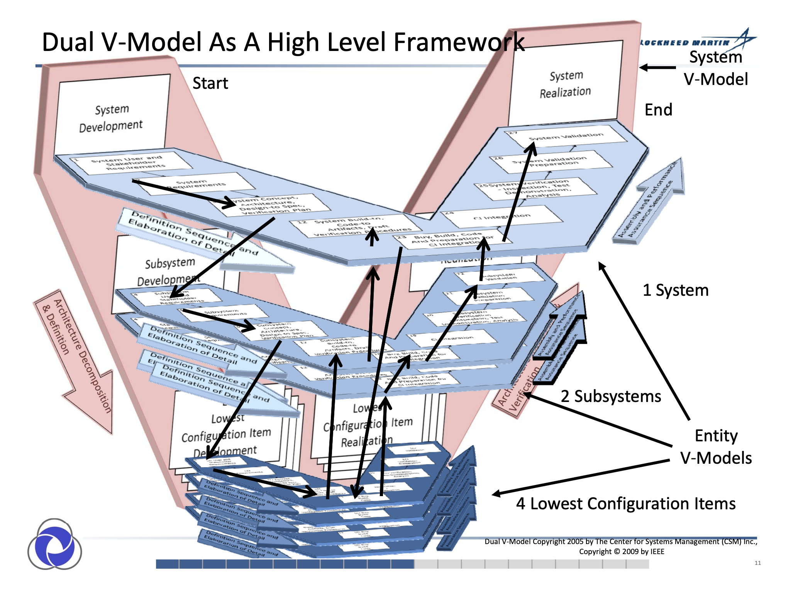
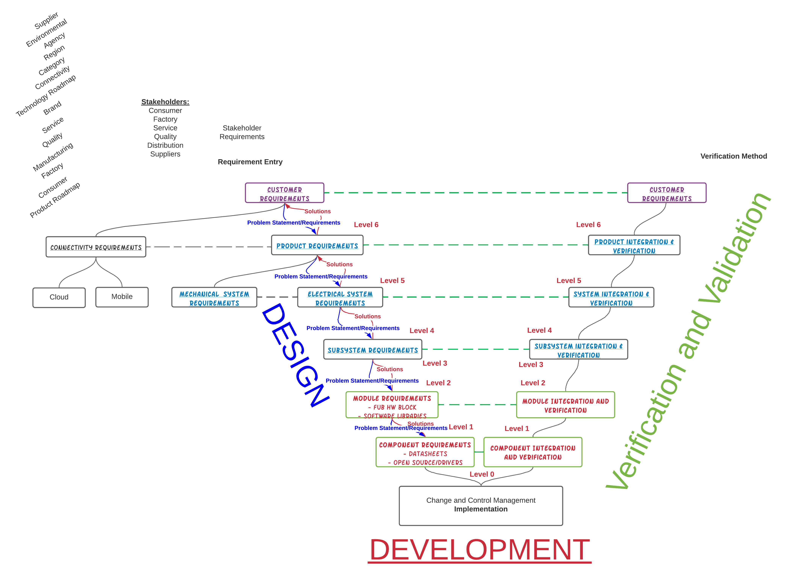
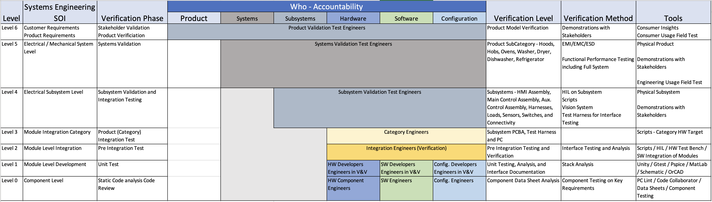
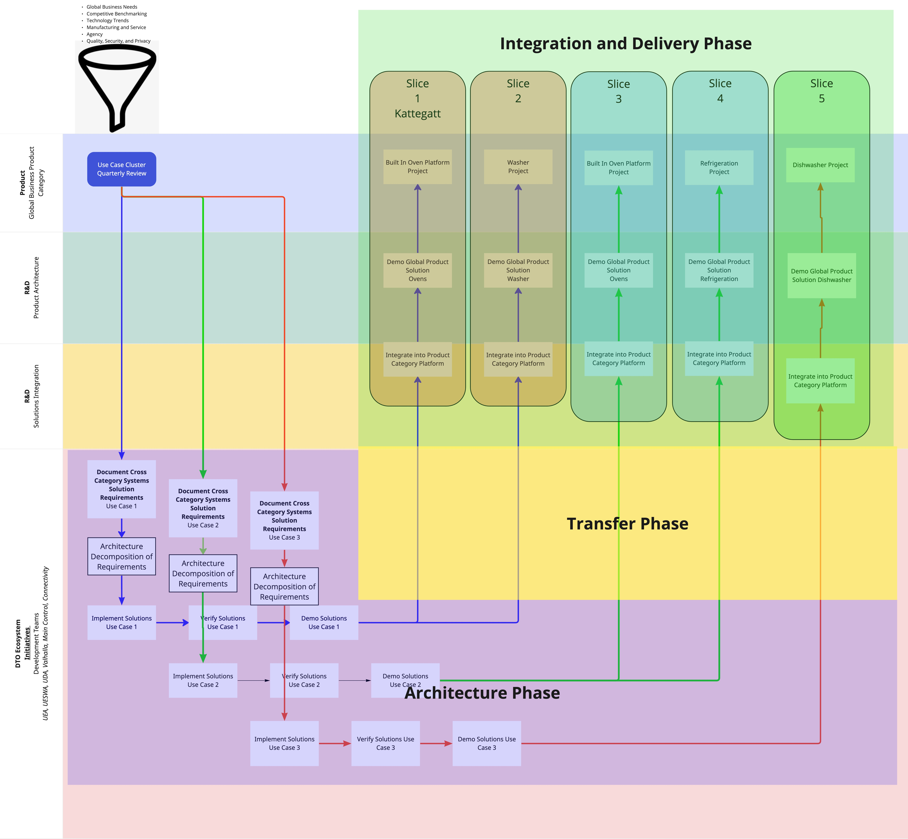

Systems Engineering

## Contact Information
Wallace ”Jay” Elston
Group Technology Organization, CX
Director of Systems Engineering - Group Electronics Organization

3100 Hutchinson-McDonald Rd
Charlotte, NC 28269
704.280.7466

Email: wallace.elston@electrolux.com 
## Accountabilities

- [Teaming](./Teaming.md)

	- [Stakeholders - Quality](./Teaming.md)
	- [Stakeholders - Service](./Teaming.md)
	- [Stakeholders - Manufacturing](./Teaming.md)

	- [Cross Category Architecture](./Teaming.md)
	- [Category Architecture](./Teaming.md)
	- [SubCategory Architecture](./Teaming.md)

## What is Systems Engineering

[Per INCOSE](https://www.incose.org/about-systems-engineering/system-and-se-definition/systems-engineering-definition)
 
Systems Engineering focuses on:
- establishing, balancing and integrating stakeholders’ goals, purpose and success criteria, and defining actual or anticipated customer needs, operational concept and required functionality, starting early in the development cycle;
- establishing an appropriate lifecycle model, process approach and governance structures, considering the levels of complexity, uncertainty, change, and variety;
- generating and evaluating alternative solution concepts and architectures;

- baselining and modelling requirements and selected solution architecture for each phase of the endeavour;
- performing design synthesis and system verification and validation;
-  while considering both the problem and solution domains, taking into account necessary enabling systems and services, identifying the role that the parts and the relationships between the parts play with respect to the overall behaviour and performance of the system, and determining how to balance all of these factors to achieve a satisfactory outcome.

Systems Engineering provides facilitation, guidance and leadership to integrate the relevant disciplines and specialty groups into a cohesive effort, forming an appropriately structured development process that proceeds from concept to production, operation, evolution and eventual disposal.

Systems Engineering considers both the business and the technical needs of customers with the goal of providing a quality solution that meets the needs of users and other stakeholders, is fit for the intended purpose in real-world operation, and avoids or minimizes adverse unintended consequences.

The goal of all Systems Engineering activities is to manage risk, including the risk of not delivering what the customer wants and needs, the risk of late delivery, the risk of excess cost, and the risk of negative unintended consequences.  One measure of utility of Systems Engineering activities is the degree to which such risk is reduced.  Conversely, a measure of acceptability of absence of a System Engineering activity is the level of excess risk incurred as a result.
 
## Why is it important
1. Connects to Consumers Needs
1. Drives Clarity to Stakeholders, Product Owners, Design Teams, Engineering and Verification and Validation.
1. Traceability of Requirements, decomposition into design requirements, implementation and Verification and Validation.
1. Standard Architectures and Interfaces.
1. Predictability and Reliability of Performance and Delivery
1. Ensures compliance to requirements with linkage to test cases, results and approvals.
1. Problem Solving Strategioes and Tools to identify Cost versus Benefit of Design Options.
 
## Who does it benefit

Everyone in the Organization

## Requirements Management
Characteristics of a Good Requirements:
1. Good Requirements meet a specific need from a Stakeholder
1. Good Requirements are Understandable and Unambiguous.  They are Clear and Concise, including the words like SHALL and MUST.
1. Good Requirements are attainable based on current technologies and understandings.
1. Good Requirements are measurable and verifiable.

## INCOSE V Model from Architecture to Execution  

  
  

## V Model for Requirement Decomposition 

  
  

  
  

 
## Requirements 
Functional Requirements and Non Functional Requirements:
 
[Functional Requirements](https://en.wikipedia.org/wiki/Functional_requirement)
"What the system Shall Do."
 
[Non Functional Requirements](https://en.wikipedia.org/wiki/Non-functional_requirement)
"Judges the Operation of the System of Design"

## Levels of Requirements

## Process 

  
  
