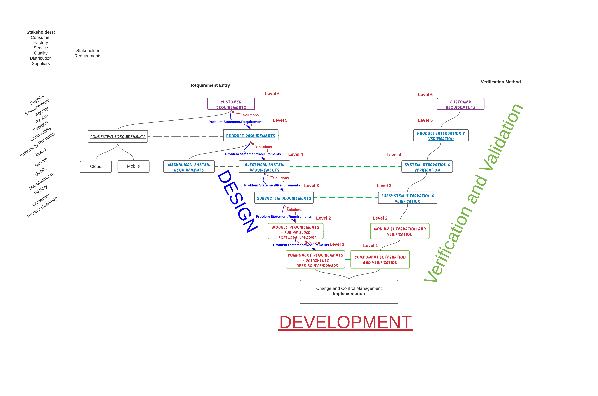
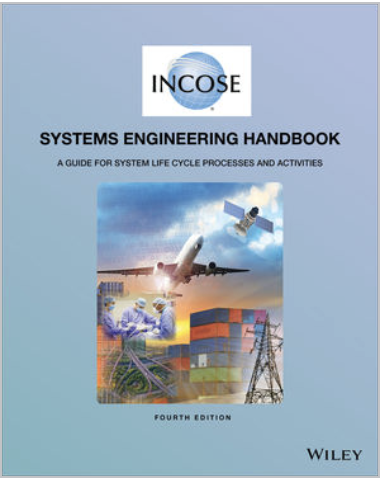
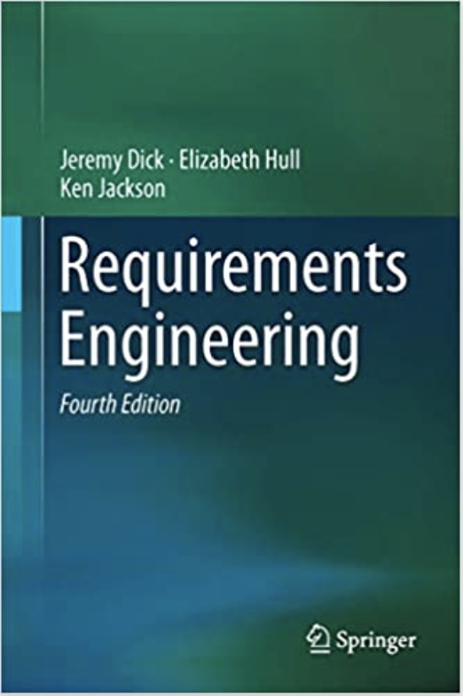
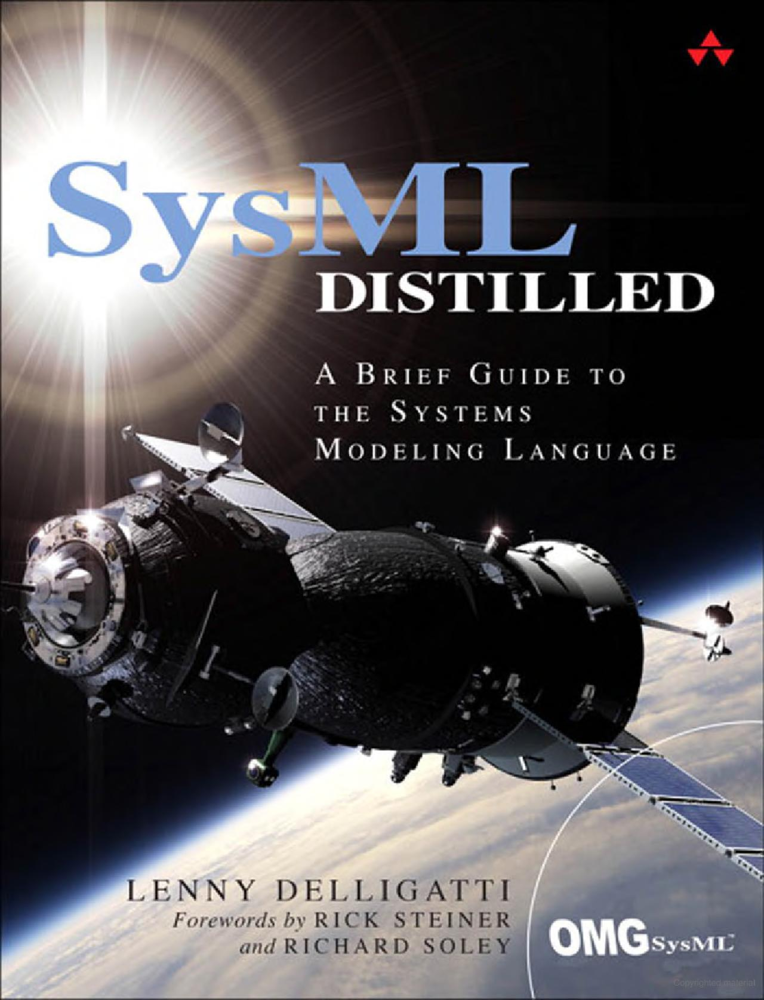
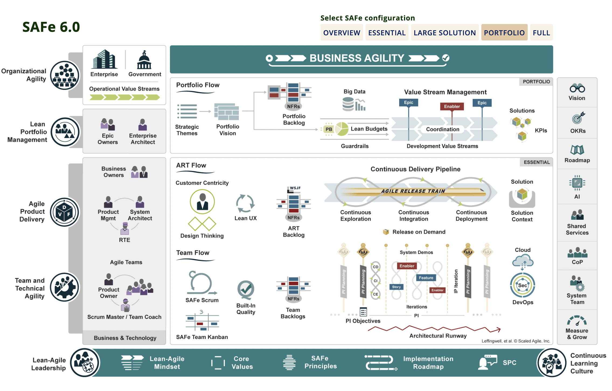

Training and Cerification

## Table of Contents:
1. [Process for Training and Certification](#process-for-training-and-certification)
1. [V Model for Decomposition Phases and  Levels](#v-model-for-decomposition-phases-and-levels)
1. [Systems Engineering Per INCOSE](#systems-engineering-per-incose)
1. [MIT Course Training](#mit-course-training)
1. [Books and Articles](#books-and-articles)
1. [Sysnovation Training](#sysnovation-training)
1. [Requirements Engineering](#requirements-engineering)
1. [Tools](#tools)
1. [Qualification Levels](#qualifications-levels)
1. [SAFe Agile Framework](#safe-agile-framework)

## Process for Training and Certification 

1. Review White Paper
1. Contact:  Wallace Elston
1. Complete Phase 1 Review Board
1. Approval for MIT Course Training
1. Complete Phase 2 MIT Course Training
1. Approval for INCOSE Certification
1. INCOSE Class Scheduled (20 participant)
1. Approval for INCOSE Exam and Certification with Prometrics
1. Exam for CSEP (Certified Systems Engineering Professional)
1.  CSEP Certification (Exam Passed)
 
[Electrolux White Paper Systems Engineering](./Systems%20Engineering.md)

## V Model for Decomposition Phases and  Levels 

Phases:

1. Design and Architecture Phase
1. Development Phase
1. Verification and Validation Phase

Decomposition Levels:

- Standard Types Requirements and Interfaces 
	
	- Stakeholders Requirements and Use Cases
	- Product Requirements and Interfaces
	- Mechanical Requirements and Interfaces
	- Electrical System Requirements and Interfaces
	- Electronics Subsystem Requirements and Interfaces
	- Hardware Requirements and Interfaces
	- Software Requirements and Interfaces
	- Configuration Requirements and Interfaces

  
  

**Stakeholders** -  Include those who interact with the Electrical, Connected or Electronics Systems, including:
- Factory Manufacturing
- Supplier Manufacturing
- Service
- Quality
- Distribution
- End User/Consumer

Covering topics

 ## Systems Engineering per INCOSE 

[Systems Engineering INCOSE White Paper](https://www.incose.org/docs/default-source/ProductsPublications/a-complexity-primer-for-systems-engineers.pdf)

[INCOSE Information and Handbooks Folder](https://electrolux-my.sharepoint.com/:f:/r/personal/wallace_elston_electrolux_com/Documents/Desktop/INCOSE%20Handbooks?csf=1&web=1&e=fvHYVx)
 
## MIT Course Training 
Sign Up: 
[Architecture and Systems Engineering: Models and Methods to Manage Complex Systems](https://xpro.mit.edu/programs/program-v1:xPRO+SysEngx/)
 
Courses:
- [Models In Engineering](https://xpro.mit.edu/courses/course-v1:xPRO+SysEngx2/)
- [Architecture of Complex Systems](https://xpro.mit.edu/courses/course-v1:xPRO+SysEngx1/)
- [Model Based Systems Engineering: Documentation and Analysis](https://xpro.mit.edu/courses/course-v1:xPRO+SysEngx3/)
- [Quantitative Methods of Systems Engineering](https://xpro.mit.edu/courses/course-v1:xPRO+SysEngx4/)
 

## Books and Articles 
### INCOSE 

- [Systems Engineering Handbook version 4 Tutorial](https://electrolux-my.sharepoint.com/personal/wallace_elston_electrolux_com/_layouts/15/onedrive.aspx?FolderCTID=0x012000548670E13EAACA488448EF800443A2D2&id=%2Fpersonal%2Fwallace%5Felston%5Felectrolux%5Fcom%2FDocuments%2FDesktop%2FINCOSE%20Handbooks%2FSE%5FHandbook%5FV4%5FTutorialAll%2Epdf&parent=%2Fpersonal%2Fwallace%5Felston%5Felectrolux%5Fcom%2FDocuments%2FDesktop%2FINCOSE%20Handbooks)

- [Systems Engineering and Systems Definitions](https://electrolux-my.sharepoint.com/personal/wallace_elston_electrolux_com/_layouts/15/onedrive.aspx?FolderCTID=0x012000548670E13EAACA488448EF800443A2D2&id=%2Fpersonal%2Fwallace%5Felston%5Felectrolux%5Fcom%2FDocuments%2FDesktop%2FINCOSE%20Handbooks%2FINCOSE%2DSE%2Ddefinitions%2DTP%2D2020%2D002%2D06%2Epdf&parent=%2Fpersonal%2Fwallace%5Felston%5Felectrolux%5Fcom%2FDocuments%2FDesktop%2FINCOSE%20Handbooks)

- [Systems Engineering Handbook](https://electrolux-my.sharepoint.com/personal/wallace_elston_electrolux_com/_layouts/15/onedrive.aspx?FolderCTID=0x012000548670E13EAACA488448EF800443A2D2&id=%2Fpersonal%2Fwallace%5Felston%5Felectrolux%5Fcom%2FDocuments%2FDesktop%2FINCOSE%20Handbooks%2FINCOSE%20Systems%20Engineering%20Handbook%204e%202015%2007%2Epdf&parent=%2Fpersonal%2Fwallace%5Felston%5Felectrolux%5Fcom%2FDocuments%2FDesktop%2FINCOSE%20Handbooks)

  
  

## Sysnovation Training 
  How to get a copy of INCOSE Handbook
  - [Click on Link to purchase a copy](https://www.wiley.com/en-us/INCOSE+Systems+Engineering+Handbook%3A+A+Guide+for+System+Life+Cycle+Processes+and+Activities%2C+4th+Edition-p-9781118999400)
  - [Click on Link to Join INCOSE for Free Copy](https://www.incose.org/)

- [Sysnovation Training Website](https://sysnovation.com/training)
	
	- [Systems Engineering Principles](https://img1.wsimg.com/blobby/go/7821fdde-8c95-43a0-8e82-a7f8d39e94ca/downloads/1cbe1ucev_611399.pdf?ver=1610991622678)
	- [Requirements Formulation](https://img1.wsimg.com/blobby/go/7821fdde-8c95-43a0-8e82-a7f8d39e94ca/downloads/1cbe24lnl_981815.pdf?ver=1610991622678)
	- [Soft Skills for Systems Engineers](https://img1.wsimg.com/blobby/go/7821fdde-8c95-43a0-8e82-a7f8d39e94ca/downloads/1cbe2ik1i_648903.pdf?ver=1610991622679)
	- [Systems of Systems Engineering](https://img1.wsimg.com/blobby/go/7821fdde-8c95-43a0-8e82-a7f8d39e94ca/downloads/1cbe2bqja_140655.pdf?ver=1610991622678)
	- [INCOSE CSEP/ASEP Preparation](https://img1.wsimg.com/blobby/go/7821fdde-8c95-43a0-8e82-a7f8d39e94ca/downloads/1cbe2km3m_982836.pdf?ver=1618528305584)

## Requirements Engineering 

  
  

Modeling Languages:
- [SysML](https://sysml.org/)
- [Rhapsody](https://www.ibm.com/products/rhapsody-designer-for-systems-engineers)
- [UML](https://www.uml.org/)

Modeling Applications and Literature:
- [SysML](https://sysml.org/)
	

  
  

 

## Tools:  

- [Jama Requirements Management](https://electrolux.jamacloud.com/login.req#/home)

- [Jama Help](https://electrolux.jamacloud.com/perspective.req#/projects/111/dashboard/111)

### Pugh Matrix:  

- [Pugh Matrix Example](https://electrolux-my.sharepoint.com/personal/wallace_elston_electrolux_com/_layouts/15/onedrive.aspx?login_hint=wallace%2Eelston%40electrolux%2Ecom&id=%2Fpersonal%2Fwallace%5Felston%5Felectrolux%5Fcom%2FDocuments%2FDesktop%2FPugh%20Matix&view=0)

### N2 Diagrams:  

- [N2 Diagrams for Interfaces](https://www.incose.org/docs/default-source/enchantment/210609-davies-interface-management.pdf?sfvrsn=5abd66c7_2)
- [N2 Diagram Wikipedia](https://en.wikipedia.org/wiki/N2_chart)

### A3 Template: 

  
  
 

- [A3 Training Video (11:43 Minutes:Seconds) – Training Video and overall explanation of the A3 Process and I found to be helpful in explaining the benefits of A3](https://www.youtube.com/watch?v=ZWx3YGZrat8)

- [A3 Database – Location to Store A3 Completed and to be leveraged within the Knowledge Database.](https://electrolux-my.sharepoint.com/:f:/r/personal/wallace_elston_electrolux_com/Documents/Desktop/A3%20Knowledge%20Management?csf=1&web=1&e=II0mds)

- [A3 - Template - Standard Template to Start with, Copy, Save and Fill Out](https://electrolux-my.sharepoint.com/personal/wallace_elston_electrolux_com/_layouts/15/onedrive.aspx?csf=1&web=1&e=II0mds&cid=2065a5bf%2Db394%2D4915%2D9dc7%2D5c30d2e4d403&id=%2Fpersonal%2Fwallace%5Felston%5Felectrolux%5Fcom%2FDocuments%2FDesktop%2FA3%20Knowledge%20Management&FolderCTID=0x012000548670E13EAACA488448EF800443A2D2&view=0)

 
- Where to Locate all A3 for Knowledge Management TEAMS:

	- [A3 Knowledge Management](https://electrolux-my.sharepoint.com/:f:/r/personal/wallace_elston_electrolux_com/Documents/Desktop/A3%20Knowledge%20Management?csf=1&web=1&e=II0mds)

### Process  

1. Where to obtain the A3 Template for Download. [Link](https://electrolux-my.sharepoint.com/personal/wallace_elston_electrolux_com/_layouts/15/onedrive.aspx?csf=1&web=1&e=II0mds&cid=2065a5bf%2Db394%2D4915%2D9dc7%2D5c30d2e4d403&id=%2Fpersonal%2Fwallace%5Felston%5Felectrolux%5Fcom%2FDocuments%2FDesktop%2FA3%20Knowledge%20Management&FolderCTID=0x012000548670E13EAACA488448EF800443A2D2&view=0)
1. What to name of your file.
	-  "A3 Project Number OR Project Name with the Explanation of Problem you are solvling"
	- **Example:** "A3 Horizon Systems Architecture - Improving Time of Delivery"
	- **Example:** "A3 Horizon Software Architecture - Memory Limitations on NXP MicroController M0"
1. Where to place for Knowledge Management and Sharing.
	- [Food Preparation](https://electrolux-my.sharepoint.com/:f:/r/personal/wallace_elston_electrolux_com/Documents/Desktop/A3%20Knowledge%20Management/Food%20Preparation?csf=1&web=1&e=rQFLZ6)
	- [Food Preservation](https://electrolux-my.sharepoint.com/:f:/r/personal/wallace_elston_electrolux_com/Documents/Desktop/A3%20Knowledge%20Management/Food%20Preservation?csf=1&web=1&e=diSvqo)
	- [Laundry](https://electrolux-my.sharepoint.com/:f:/r/personal/wallace_elston_electrolux_com/Documents/Desktop/A3%20Knowledge%20Management/Care?csf=1&web=1&e=D8UcEn)
	- [Cross Category](https://electrolux-my.sharepoint.com/:f:/r/personal/wallace_elston_electrolux_com/Documents/Desktop/A3%20Knowledge%20Management/Cross%20Category?csf=1&web=1&e=AM0Qhd)
1. Document and Review the Problem Statement with your Peers in the Systems Engineering Community for clarity surrounding the Problem Statement.
1. Identify Subject Matter Experts who can support the A3 Process to drive to the solution.  The expectations are that the assigned owner of the A3, along with the Subject Matter Experts will drive this A3 to its conclusion.
1. Once A3 is completed it will be reviewed with the Peers, Stakeholders, appropriate Managers to align all on the solution to the problem.
1. Finally A3 will be saved and closed in the appropriate Knowledge Management Repository.

## Qualifications Levels  

Resource: [INCOSE Competency Resource](https://www.incose.org/products-and-publications/competency-framework)
- [INCOSE.org Competency Levels.pdf](https://electrolux.sharepoint.com/sites/NEXUSSystemsEngineeringCompetence/Shared%20Documents/Forms/AllItems.aspx?id=%2Fsites%2FNEXUSSystemsEngineeringCompetence%2FShared%20Documents%2FGeneral%2FINCOSE%20Folder%2FINCOSE%20SE%20Competency%20ISECF%2Dv1%2Epdf&parent=%2Fsites%2FNEXUSSystemsEngineeringCompetence%2FShared%20Documents%2FGeneral%2FINCOSE%20Folder)
 
 
**Description:**  

The application of the fundamental concepts of systems thinking to systems engineering. These include understanding what a system is, its context within its environment, its boundaries and interfaces and that it has a lifecycle. The definition, development and production of systems within an enterprise and technological environment.
 
**Why It Matters:**  

Systems thinking is a way of dealing with increasing complexity. The fundamental concepts of systems thinking involves understanding how actions and decisions in one area affect another, and that the optimization of a system within its environment does not necessarily come from optimizing the individual system components. Systems Engineering is conducted within an enterprise and technological context. These contexts impact the lifecycle of the system and place requirements and constraints on the Systems Engineering being conducted. Failing to meet such constraints can have a serious effect on the enterprise and the value of the system
 
 
 
### Competency Levels: 

- NO EXPERIENCE
- TRAINEE  (__Awareness__) - I am just starting
- NOVICE (__Supervised Practitioner__) - I just know enough to perform basic operation. I need support from my peers.
- INTERMEDIATE (__Practitioner__) - I know enough to do what I need to do in most of the cases (75%).
- ADVANCED (__Lead Practitioner__) - I am at ease to perform all I need to do.
- EXPERT (__Expert__) -  I fully master the tools (HW & SW) for what I need to do. I also support colleagues.

**No Experience**
The person has not heard of, participated in, nor experienced anything relating to Systems Engineering.

**Awareness**
The person displays knowledge of key ideas associated with the competency area and understands key issues and their implications. They ask relevant and constructive questions on the subject. This level characterizes engineers new to the competency area. It could also characterize an individual outside Systems Engineering who requires an understanding of the competency area to perform their role. 

**Supervised Practitioner**
The person displays an understanding of the competency area and has some limited experience. They require regular guidance and supervision. This level defines those engineers who are “in-training” or are inexperienced in that competency area. 

**Practitioner**
The person displays both knowledge and practical experience of the competency area and can function without supervision on a day-to-day basis. They are also capable of providing guidance and advice to less experienced practitioners. 

**Lead Practitioner**
The person displays extensive and substantial practical knowledge and experience of the competency area and provides guidance to others including practitioners encountering unusual situations. Typically, this level is associated with an individual who is the “go-to” person for advice and to determine best practice within the competency area within an organization or business unit. 

**Expert**
In addition to extensive and substantial practical experience and applied knowledge of the competency area, this individual contributes to and is recognized beyond the organizational or business boundary. Typically, this level is associated with an individual contributing to and defining regional or international best practices within the competency area. 

 ## SAFe Agile Framework 
[SAFe Agile Development](https://scaledagileframework.com/)
Reference Only, see link above for latest version "SAFe Agile Development"
 

  
  
