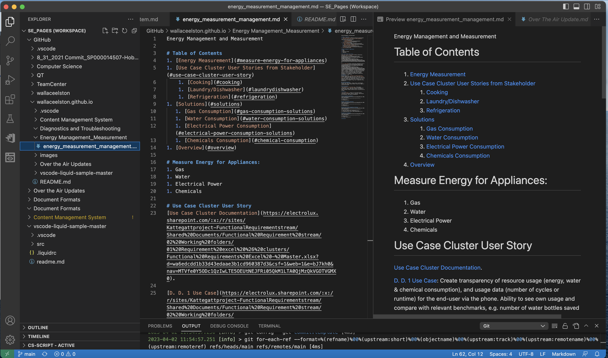
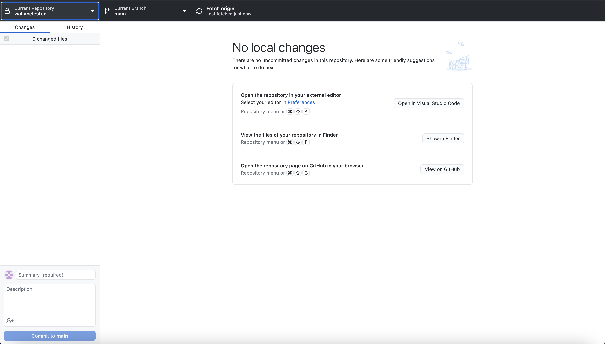
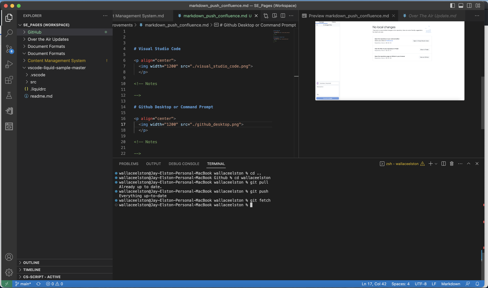
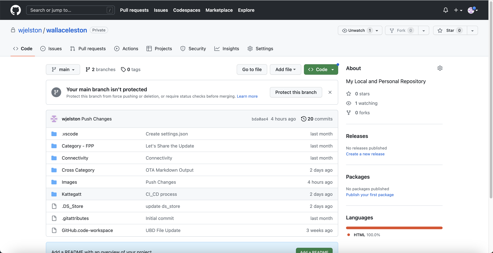
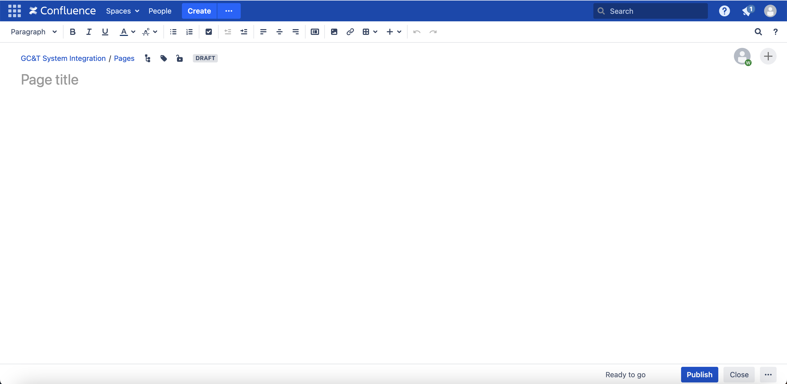

# Visual Studio Code

  
  

<!-- Notes

-->

# Github Desktop or Command Prompt

  
  

<!-- Notes

-->

  
  

<!-- Notes

-->

# Github WebPage for Documentation

Pushes locally from Visual Studio to Github, synchronizing documentation, and allowing multiple collaborators to contribute and merge, like software development.

  
  

<!-- Notes

-->

[Github Pages from Visual Studio and Github Push](https://github.com/wjelston/wallaceelston.github.io/blob/main/continuous_process_improvements/markdown_push_confluence.md)

<!-- Notes

-->

# Confluence WebPage for Documentation

- Have to be online and have a network connection.
- Must Update while online and unable to work offline.
- Unable to merge when multiple people are working on same file.

  
  

<!-- Notes

-->